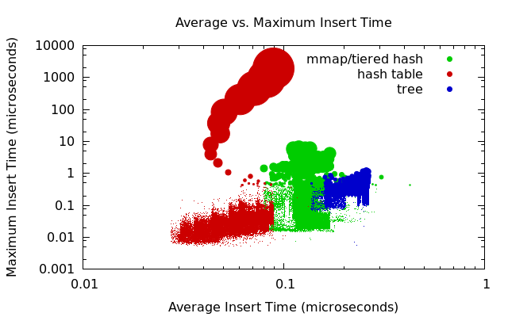

Deamortized Hash Tables
======================

Hash tables are usually very fast, but have some very slow operations when rehashing is required.
This project provides a partially deamortized hash table that reduces the worst-case insert time.
This reduction has a cost: the average insert time increases.
For some applications, this may be a good tradeoff.

