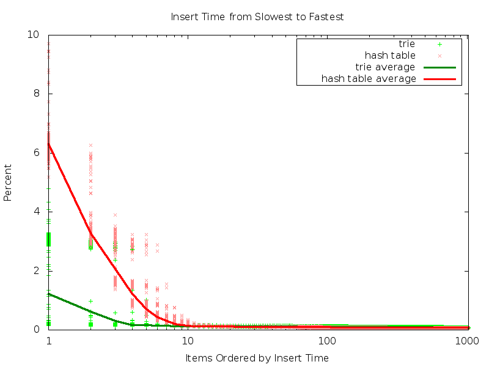

Deamortized Hash Tables
======================

Hash tables are usually very fast, but have some very slow operations when there are too many collisions or rehashing is required.

The discontinuities in the hash table times are artifacts of rehashing.
The trie is a little bit slower, but it is more consistent.

If we order the insert times from slowest to fastest, it's clear that slow trie operations are usually much faster than slow hash table operations:

Here the slowest insert is placed at 1 on the x axis, the second slowest at 2, and so on.
For this experiment, the slowest hash table inserts take a large amount of time, when compared to the total time to build the hash table.
