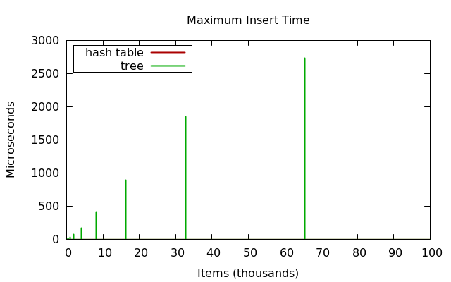
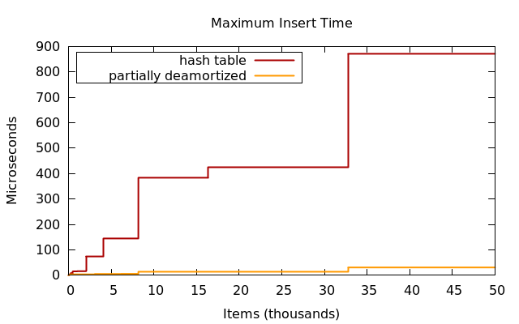
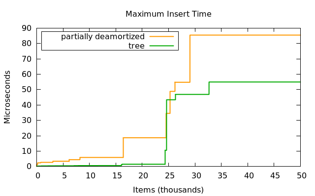

Deamortized Hash Tables
======================

Hash tables are usually very fast, but have some very slow operations when there are too many collisions or rehashing is required.
For instance, here is a graph of the maximum insert time of elements into a hash table and a balanced binary search tree:

The hash table is much slower on its slowest insertions.
Here is a comparison between the standard hash table and a variant designed to spread the cost of the longest operations across many operations, thus reducing the maximum insert time:

This is a partial deamortization of the hash table - its performance is now reasonable not only in the amortized sense, but also in the worst-case.

Here is a zoomed-in comparison of the maximum cost of insertions in the partially deamortized hash table and the balanced binary search tree.
As you can see, the operations still can be more expensive than in the tree:

However, they are still much better than in the basic hash table.

Even though the tree has faster insertions in the worst case, its average case is worse.
In the following scatter plot, average insert time is plotted against maximum insert time.

A point close to the origin represents a structure that has low cost insertions in the worst-case and on average.
A point near the x-axis but far from the y-axis represents a structure with low worst-case insertion cost but high average insertion cost.
