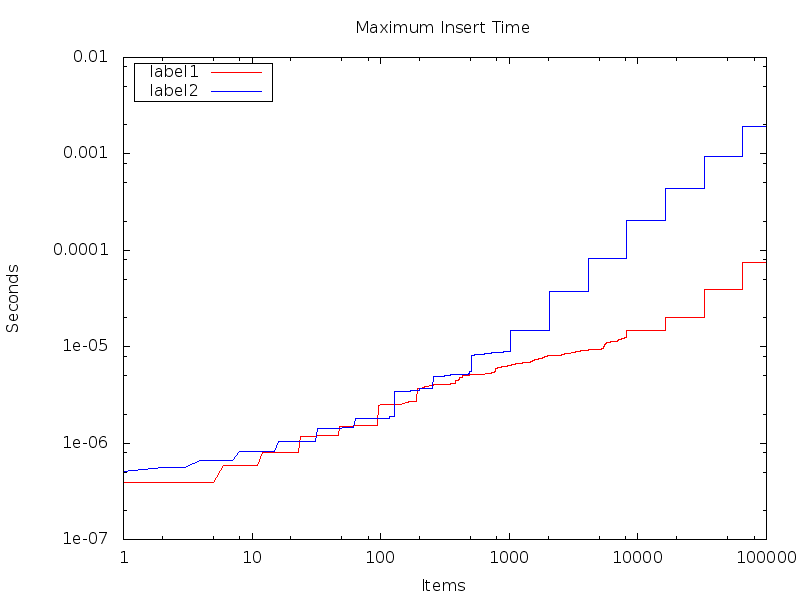

Deamortized Hash Tables
======================

Hash tables are usually very fast, but have some very slow operations when there are too many collisions or rehashing is required.
For instance, here is a graph of the average maximum insert time of elements into a hash table and a trie:

